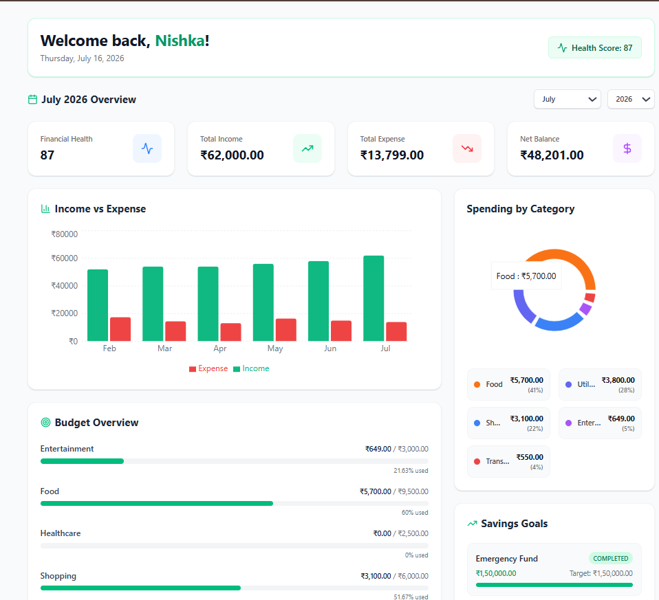
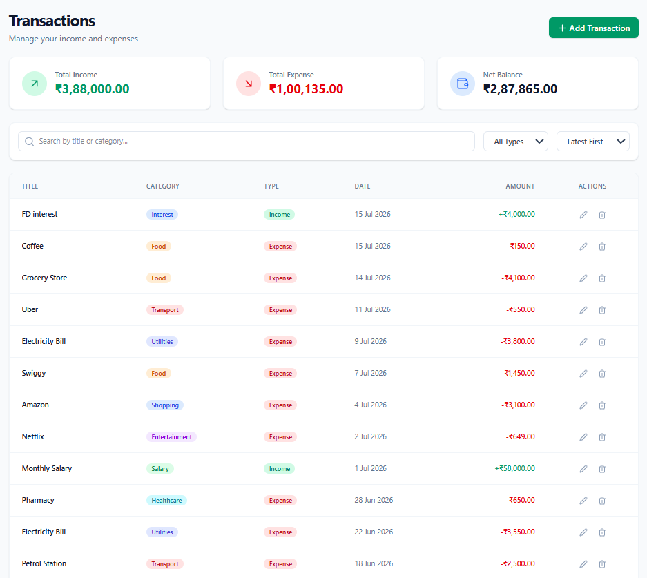
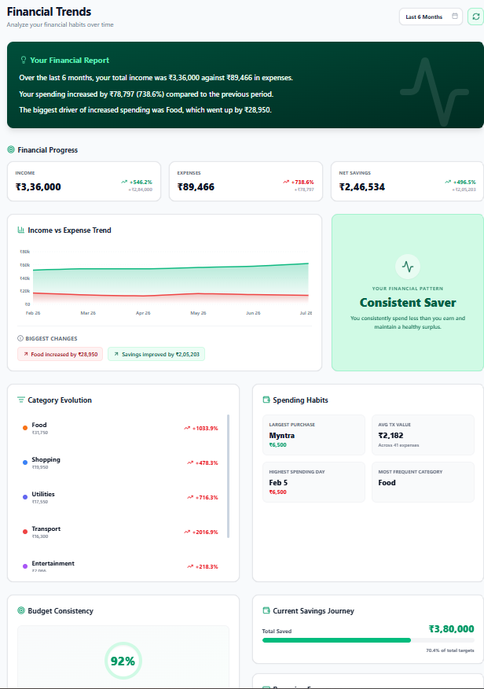
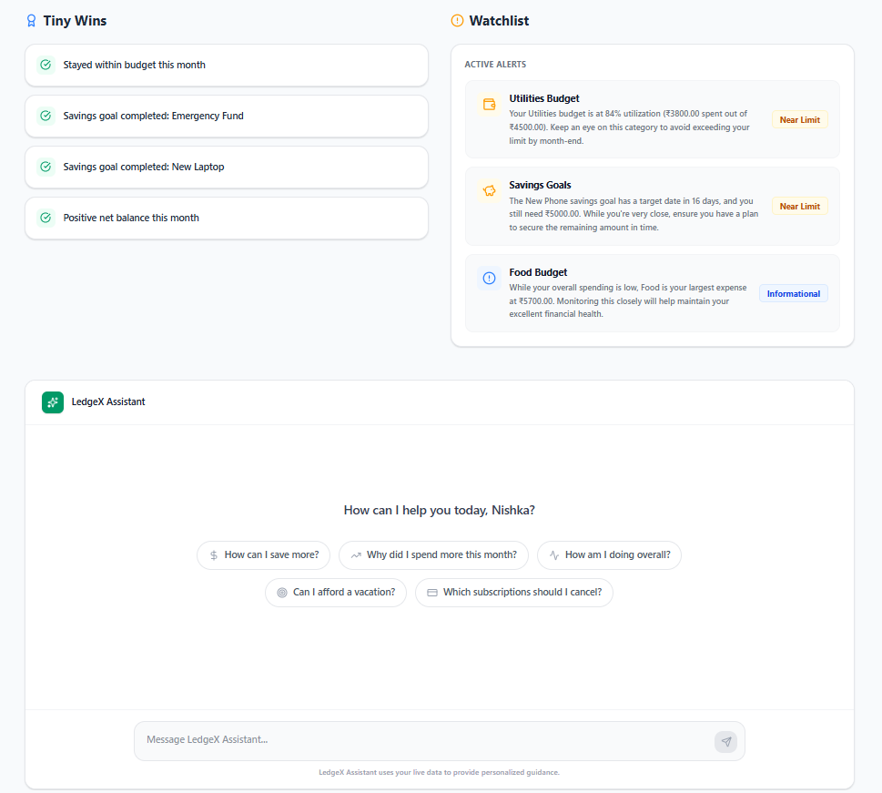
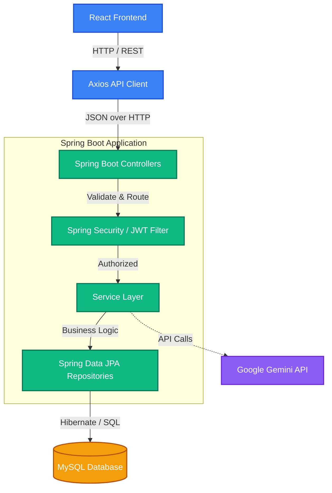

<div align="center">
  
  <h1>LedgeX</h1>
  <p><strong>Smart Personal Finance & Financial Wellness Platform</strong></p>
</div>

## 📖 About

LedgeX is a full-stack personal finance platform that helps users manage expenses, budgets, subscriptions, savings goals, financial analytics, and AI-powered financial insights through a modern, responsive dashboard. It empowers users to take control of their financial health with intuitive visualizations and personalized, intelligent advice.

## ✨ Features

### Authentication
- **JWT Authentication**: Secure stateless session management.
- **Secure Login & Registration**: Protected routes and encrypted credentials.

### Finance Management
- **Transactions**: Track, categorize, and analyze daily spending and income.
- **Budgets**: Set and monitor monthly spending limits across customizable categories.
- **Savings Goals**: Plan for the future with progress tracking for short and long-term goals.
- **Subscriptions**: Manage recurring payments, identify inactive subscriptions, and view billing cycles.

### Analytics
- **Trends**: Visualize financial growth and spending habits over time.
- **Spending & Budget Performance**: Compare actual spending against set budget thresholds.
- **Comparisons**: Month-over-month and category-by-category comparative analysis.

### AI Integration
- **Financial Coach**: A personalized, conversational AI assistant that understands your data.
- **Personalized Insights**: Auto-generated alerts, warnings, and tips based on your spending behavior.
- **Conversational Assistant**: Ask complex financial questions and get context-aware answers.

## 📸 Screenshots

### Dashboard


### Transactions


### Analytics


### AI Insights & Coach


## 🛠️ Tech Stack

**Frontend**
- React
- TailwindCSS
- Axios
- Recharts
- Lucide Icons
- Vite

**Backend**
- Java Spring Boot
- Spring Security
- JWT (JSON Web Tokens)
- JPA / Hibernate
- Maven

**Database**
- MySQL

**AI**
- Google Gemini API

## 🏗️ Architecture



## 📁 Folder Structure

```
ledgex/
├── ledgex_frontend/          # React application
│   ├── public/               # Static assets & images
│   ├── src/
│   │   ├── components/       # Reusable UI components
│   │   ├── context/          # React Context (Auth, Theme)
│   │   ├── pages/            # Main application views
│   │   ├── services/         # Axios API services
│   │   └── utils/            # Helper functions
│   └── package.json
│
├── ledgex_backend/           # Spring Boot application
│   ├── src/main/java/com/ledgex/
│   │   ├── auth/             # Authentication & Security
│   │   ├── transaction/      # Transaction logic
│   │   ├── budget/           # Budget management
│   │   ├── savings/          # Savings goals
│   │   ├── subscription/     # Recurring subscriptions
│   │   ├── analytics/        # Financial trends & metrics
│   │   └── ai/               # Gemini API integration
│   ├── src/main/resources/
│   │   └── application.properties # Configuration
│   └── pom.xml
│
└── README.md                 # Project documentation
```

## 🔌 API Endpoints (Major)

| Method | Endpoint | Description |
|--------|----------|-------------|
| `POST` | `/api/v1/auth/register` | Register a new user |
| `POST` | `/api/v1/auth/login` | Authenticate and receive JWT |
| `GET`  | `/api/v1/transactions` | Fetch user transactions (filterable) |
| `GET`  | `/api/v1/analytics/overview` | Fetch high-level analytics KPIs |
| `POST` | `/api/v1/ai/chat` | Send a message to the AI Financial Coach |

## 🚀 Installation

1. **Clone the repository:**
   ```bash
   git clone https://github.com/yourusername/ledgex.git
   cd ledgex
   ```

2. **Frontend Setup:**
   ```bash
   cd ledgex_frontend
   npm install
   npm run dev
   ```

3. **Backend Setup:**
   - Ensure MySQL is running and create a database named `ledgex_db`.
   - Update `application.properties` with your database credentials and Gemini API key.
   ```bash
   cd ledgex_backend
   mvn clean install
   mvn spring-boot:run
   ```

## 🚀 Future Improvements

- **OCR Receipt Scanner**: Automatically extract transaction details from photos of receipts.
- **Investment Tracking**: Integrate stock and crypto portfolio tracking alongside traditional banking.
- **Bank Integration**: Connect live bank accounts via APIs (like Plaid) for real-time transaction syncing.
- **Notifications**: Email and push notifications for budget limits and upcoming subscription renewals.
- **Mobile App**: Port the responsive web design into a dedicated React Native mobile application for iOS and Android.

---
## 🔮 Future Scope

- Banking & UPI integration with real-time transaction sync
- AI-powered financial forecasting
- Investment & portfolio tracking
- OCR-based receipt scanning
- Voice-based expense management
- Shared family expense management
- Financial credit score analysis
- Multi-currency support
- AI chatbot for financial assistance
- Mobile application (React Native)

---

## 🔑 Demo Account

If you want to explore the application without creating a new account, you can use the following demo credentials. This account comes pre-populated with realistic financial data.

**Email:**
`nishka@ledgex.demo`

**Password:**
`password123`

---

## 👤 Author

Nishka Shah

---

## 📄 License

This project is for educational purposes.

---
*Built with ❤️ for better financial wellness.*
